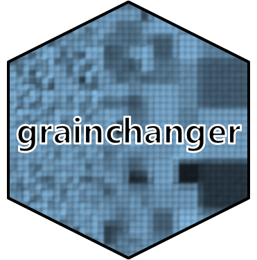

<!-- README.md is generated from README.Rmd. Please edit that file -->

```{r, include = FALSE}
knitr::opts_chunk$set(
  collapse = TRUE,
  warning = FALSE,
  message = FALSE,
  comment = "#>",
  fig.path = "man/figures/README-",
  out.width = "100%"
)
```
# grainchanger 

<!-- badges: start -->
[](https://travis-ci.org/laurajanegraham/grainchanger)
[](https://ci.appveyor.com/project/laurajanegraham/grainchanger)
[](https://codecov.io/gh/laurajanegraham/grainchanger?branch=master)
[](https://cran.r-project.org/package=grainchanger)
[](https://cran.r-project.org/package=grainchanger)
[](https://www.repostatus.org/#active)

<!-- badges: end -->

The `grainchanger` package provides functionality for data aggregation to a coarser resolution via moving-window or direct methods. 

As landscape ecologists and macroecologists, we often need to aggregate data in order to harmonise datasets. In doing so, we often lose a lot of information about the spatial structure and environmental heterogeneity of data measured at finer resolution. An example of this is when the response data (e.g. species' atlas data) are available at a coarser resolution to the predictor data (e.g. land-use data). We developed this method and R package in order to overcome some of these issues. 

For more information on the [background to and motivation for](background.html) the development of this method, see [Graham *et al.* 2019 in *Methods in Ecology and Evolution*](https://doi.org/10.1111/2041-210X.13177). 

# Package overview

The primary functions of the `grainchanger` package are those which facilitate moving-window (`winmove_agg`) and direct (`nomove_agg`) data aggregation. These functions aggregate fine-grain data (`fine_dat`) to a coarse-grain (`coarse_dat`) using a function specified by the user (`agg_fun`). The moving-window method takes in an additional function (`win_fun`) which smooths the fine-grain data prior to aggregation. 

The moving-window smoothing function is also available in the package (`winmove`), as well as several [built-in functions](functions.html), and an additional utility function for use with simulated landsacpes (`create_torus`).

The `winmove` function acts as a convenient wrapper to `raster::focalWeight` and `raster::focal` which takes advantage of optimised functions built into the `grainchanger` package. 

# Installation

```
# Install release version from CRAN
install.packages("grainchanger")

# Install development version from GitHub
devtools::install_github("laurajanegraham/grainchanger")
```

# Examples

## Moving-window data aggregation

The below example shows the moving-window data aggregation in action. It aggregates a categorical raster (`fine_dat`) to a grid using Shannon evenness (specified by `win_fun`) as the function calculated within a square moving window of 5 units. The value returned is the mean (specified by `agg_fun`) of the smoothed value for each cell of `coarse_dat`. This value is included as a column on the grid `sf` object. 

```{r mwda_example, fig.show = "hold"}
library(grainchanger)
library(ggplot2)
library(landscapetools)

# categorical landscape
show_landscape(cat_ls, discrete = TRUE)

# moving-window aggregation using Shannon evenness
g_sf$mwda <- winmove_agg(coarse_dat = g_sf,
                         fine_dat = cat_ls, 
                         d = 5,
                         type = "rectangle",
                         win_fun = shei,
                         agg_fun = mean,
                         lc_class = 1:4,
                         quiet = TRUE)

ggplot(g_sf) + 
  geom_sf(aes(fill = mwda)) + 
  scale_fill_viridis_c() +
  theme_bw()
```

## Direct data aggregation

The below example shows the direct data aggregation in action. It aggregates a continuous raster to a raster with a coarser resolution using the range as the function calculated for each cell of the larger grid. The resulting output is a raster of the coarser resolution. `var_range` is an inbuilt function in the `grainchanger` package.

```{r dda_example, fig.show = "hold"}
library(raster)

# continuous landscape
show_landscape(cont_ls)

# load the coarse resolution raster
g_raster <- raster(system.file("raster/g_raster.tif", package = "grainchanger"))

# direct aggregation using range
dda <- nomove_agg(coarse_dat = g_raster,
                       fine_dat = cont_ls, 
                       agg_fun = var_range)

show_landscape(dda)
```

# Functions

There are a number of inbuilt functions in the grainchanger package, with their usage outlined below. While it is possible to use user-defined functions within both `winmove_agg` and `nomove_agg`, we welcome suggestions for additional functions. Please [add as an issue](https://github.com/laurajanegraham/grainchanger/issues) - doing it this way means we can maximise the speed of the function. 

```{r functions, echo = FALSE}
function_overview <- data.frame(
  `Function Name` = c("prop", "shdi", "shei", "range"),
  `Description` = c("Calculate the proportion of a given class", 
                    "Calculate the Shannon diversity", 
                    "Calculate the Shannon evenness", 
                    "Calculate the range of values"),
  `Additional arguments` = c("lc_class (numeric)", 
                             "lc_class (numeric)",
                             "lc_class (numeric)",
                             "")
)

knitr::kable(function_overview)
```

# Additional utilities

## Create torus

The `create_torus` function takes as input a raster and pads it by a specified radius, creating the effect of a torus. We developed this function in order to avoid edge effects when testing methods on simulated rasters (such as those from [NLMR](https://ropensci.github.io/NLMR/)). 

```{r torus}
torus <- create_torus(cat_ls, 5)

show_landscape(torus, discrete = TRUE)
```

# Contributing

We welcome contributions to this package. To contribute, submit a [pull request](https://help.github.com/en/articles/about-pull-requests) making sure `develop` is the destination branch on the [`grainchanger` repository](https://github.com/laurajanegraham/grainchanger).

# Meta

* Please [report any issues or bugs](https://github.com/laurajanegraham/grainchanger/issues/new/).
* License: GPL3
* Get citation information for `grainchanger` in R doing `citation(package = 'grainchanger')`
* Please note that the `grainchanger` project is released with a [Contributor Code of Conduct](CODE_OF_CONDUCT.md). By contributing to this project, you agree to abide by its terms.
