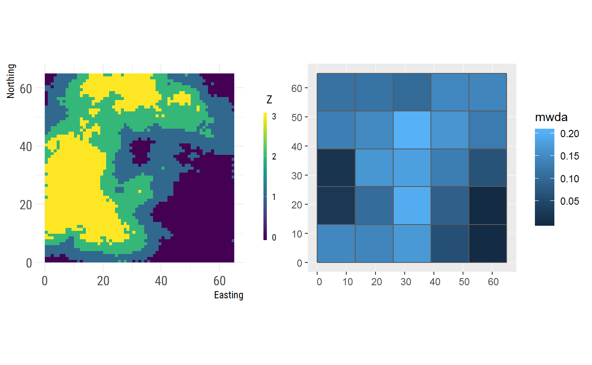
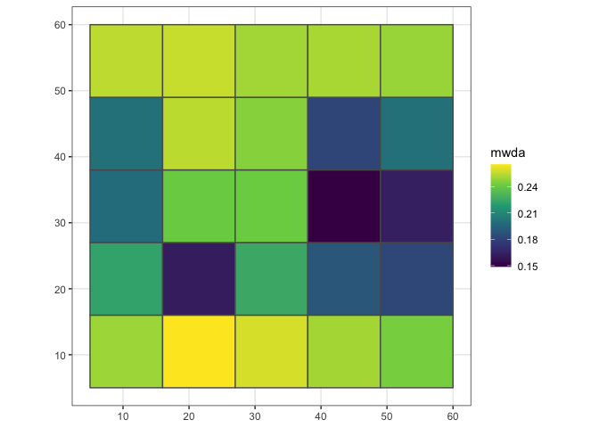
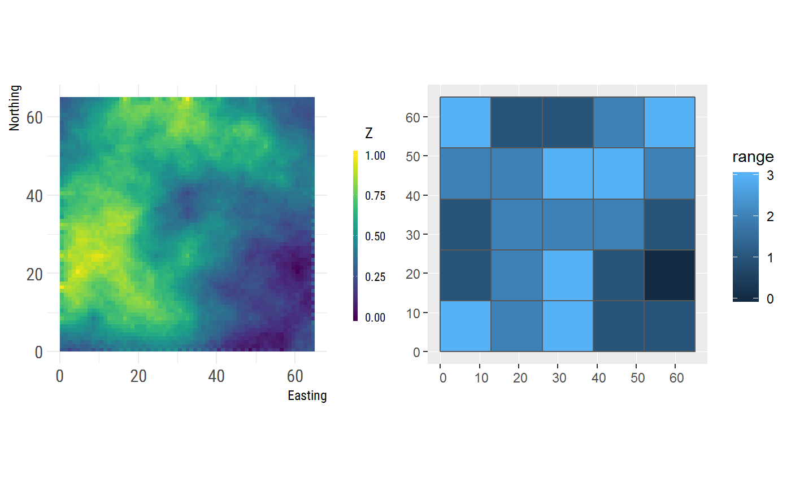
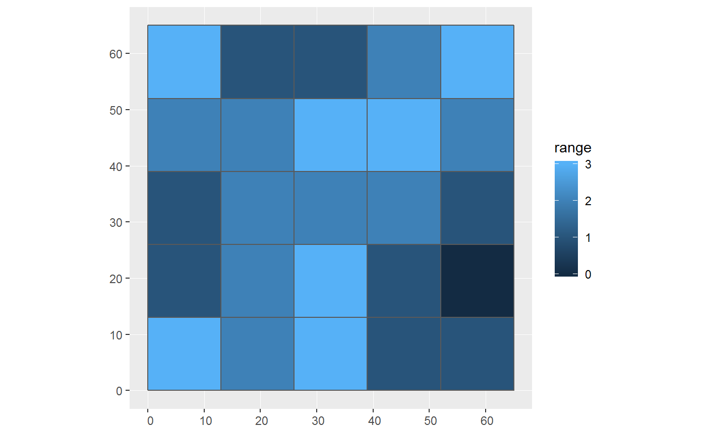
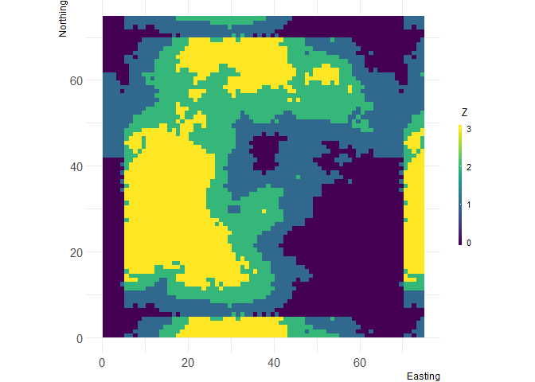

<!-- README.md is generated from README.Rmd. Please edit that file -->

# grainchanger 

<!-- badges: start -->

[](https://travis-ci.org/laurajanegraham/grainchanger)
[](https://codecov.io/gh/laurajanegraham/grainchanger?branch=master)
[](https://cran.r-project.org/package=grainchanger)
<!-- badges: end -->

The `grainchanger` package provides functionality for data aggregation
to a grid via moving-window or direct methods.

### Moving-window data aggregation

The moving-window data aggregation method smooths the surface using a
specified function within a moving window of a specified size and shape
prior to aggregation.


The moving window approach allows users to capture some information
about landscape structure at the scale at which the process acts in the
landscape.

### Direct data aggregation

The direct method simply aggregates to the grid using the specified
function, essentially acting as a wrapper for the `raster` aggregate
function.

## Installation

You can install the development version from
[GitHub](https://github.com/) with:

``` r
# install.packages("devtools")
devtools::install_github("laurajanegraham/grainchanger")
```

## Example

### Moving-window data aggregation

The below example shows the moving-window data aggregation in action. It
aggregates a categorical raster to a grid using Shannon evenness as the
function calculated within a square moving window of 5 units. This value
is included as a column on the grid `sf` object.

``` r
library(grainchanger)
library(ggplot2)
library(landscapetools)

# categorical landscape
show_landscape(cat_ls)
#> Loading required package: raster
#> Loading required package: sp
```



``` r

# moving-window aggregation using Shannon evenness
g_sf$mwda <- winmove_agg(g = g_sf,
            dat = cat_ls, 
            d = 5,
            type = "rectangle",
            fun = "shei",
            lc_class = 0:3)

ggplot(g_sf) + geom_sf(aes(fill = mwda))
```



### Direct data aggregation

The below example shows the direct data aggregation in action. It
aggregates a continuous raster to a grid using the range as the function
calculated for each cell of the larger grid. This value is included as a
column on the grid `sf` object. `var_range` is an inbuilt function in
the `grainchanger` package.

``` r
# continuous landscape
show_landscape(cont_ls)
```



``` r

# direct aggregation using range
g_sf$dda <- nomove_agg(g = g_sf,
            dat = cont_ls, 
            fun = "var_range")

ggplot(g_sf) + geom_sf(aes(fill = dda))
```



## Functions

There are a number of inbuilt functions in the grainchanger package,
with their useage outlined below. While it is possible to use
user-defined functions within both `winmove_agg` and `nomove_agg`, we
welcome suggestions for additional functions. Please [add as an
issue](https://github.com/laurajanegraham/grainchanger/issues) - doing
it this way means we can maximise the speed of the
function.

| Function.Name | Description                                                                | Additional.arguments |
| :------------ | :------------------------------------------------------------------------- | :------------------- |
| wm\_prop      | Calculate the proportion of a given class within the moving window         | lc\_class (numeric)  |
| wm\_classes   | Calculate the number of classes within the moving window                   |                      |
| wm\_shei      | Calculate the Shannon evenness within the moving window                    | lc\_class (numeric)  |
| wm\_mean      | Calculate the mean value within the moving window                          |                      |
| nm\_shei      | Calculate the Shannon evenness within the larger cell                      | lc\_class (numeric)  |
| nm\_prop      | Calculate the proportion of a given class within the larger cell           | lc\_class (numeric)  |
| var\_range    | Calculate the range of values (can be used with or without a moving window |                      |

## Additional utilities

### Create torus

The `create_torus` function takes as input a square or rectangular
landscape and pads it by a specified radius, creating the effect of a
torus. We developed this function in order to avoid edge effects when
testing methods on simulated landscapes (such as those from
[NLMR](https://ropensci.github.io/NLMR/)).

``` r
torus <- create_torus(cat_ls, 5)

show_landscape(torus)
```



## Meta

  - Please [report any issues or
    bugs](https://github.com/laurajanegraham/grainchanger/issues/new/).
  - License: GPL3
  - Get citation information for `grainchanger` in R doing
    `citation(package = 'grainchanger')`
  - Please note that the ‘grainchanger’ project is released with a
    [Contributor Code of Conduct](CODE_OF_CONDUCT.md). By contributing
    to this project, you agree to abide by its terms.
